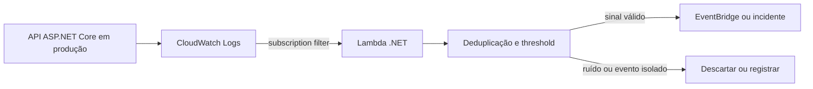

# Language Review Summary
- Status: approved
- Ajustes aplicados:
  - pontuação refinada em períodos longos;
  - repetição de termos reduzida em trechos de decisão arquitetural;
  - fluidez melhorada entre contexto, problema e conclusão.

# Language Reviewed Post

---
title: Quando um log do CloudWatch deve acordar uma Lambda em .NET
description: Como usar CloudWatch Logs para disparar uma Lambda em C#/.NET sem transformar sintoma em automação reativa e sem ampliar o ruído operacional.
pubDate: 2026-04-15
tags:
  - dotnet
  - aws
  - observability
  - reliability
  - arquitetura
---

## Contexto

Em uma API ASP.NET Core de autorização de pagamentos, o time já tinha dashboards, alarmes de erro e tracing. Ainda assim, havia um tipo de incidente que escapava do radar útil: instabilidade parcial do provedor externo. Não era indisponibilidade total. Eram ondas curtas de timeout, 429 e resposta inconsistente que começavam a degradar o checkout antes que a métrica agregada virasse um alerta acionável.

A pergunta deixou de ser apenas "como ver o problema" e passou a ser "como reagir ao primeiro sinal certo sem criar outro problema no caminho".

## O problema real

A solução ingênua parecia simples: sempre que um log de erro chegasse ao CloudWatch, disparar uma Lambda para abrir incidente, avisar o time ou até mexer em feature flags. O problema é que log bruto não é evento de domínio. É sintoma.

Em produção, isso cria pelo menos três riscos imediatos:

1. Um pico curto de erro transitório vira tempestade de invocações.
2. Uma mudança no texto do log quebra o filtro sem ninguém perceber.
3. Um sintoma local passa a acionar uma resposta sistêmica antes de qualquer validação.

## Fluxo da decisão



Se o desenho parar na linha `ERROR -> Lambda -> ação`, a arquitetura troca lentidão de diagnóstico por automação reativa demais.

## A decisão de arquitetura

A decisão correta foi usar o CloudWatch Logs como fonte de sinal de baixa latência, mas limitar a Lambda em .NET a um papel mais restrito: ingestão, enriquecimento e triagem.

O fluxo ficou assim:

- a aplicação emite logs estruturados com `provider`, `correlationId`, `tenant`, `errorCode` e `signal`;
- uma subscription filter encaminha apenas padrões de alto sinal para a Lambda;
- a Lambda decodifica o lote, extrai os eventos relevantes e deduplica por chave operacional;
- um buffer curto por janela agrupa recorrência antes de publicar um evento para investigação ou automação limitada.

| Opção | Ganho | Risco principal | Quando usar |
| --- | --- | --- | --- |
| Log bruto acionando ação direta | Latência mínima | Ruído, falso positivo e efeito cascata | Quase nunca |
| CloudWatch Logs -> Lambda .NET -> dedupe/threshold | Reação rápida com governança | Mais código e contrato de schema | Triagem operacional sensível ao tempo |
| Métrica agregada/alarme tradicional | Menos ruído | Sinal chega tarde em falhas intermitentes | Tendência e saúde agregada |

Os trade-offs ficaram explícitos:

- ganhar minutos de reação custa disciplina no schema do log e na deduplicação;
- acionar cedo demais aumenta custo e ruído;
- acionar tarde demais aumenta MTTR e abre espaço para diagnóstico manual fragmentado.

## Implementação em C#/.NET

O ponto crítico não era só parsear o evento do CloudWatch. Era recusar a tentação de agir em cima do primeiro log. No handler em C#/.NET, a responsabilidade ficou limitada a transformar lote em sinal operacional confiável.

```csharp
public sealed record OperationalSignal(
    string CorrelationId,
    string Provider,
    string ErrorCode,
    string Signal,
    DateTimeOffset OccurredAt);

public async Task FunctionHandler(CloudWatchLogsEvent input, ILambdaContext context)
{
    var signals = _cloudWatchParser
        .ReadSignals(input)
        .Where(signal => signal.Signal is "ProviderTimeout" or "Provider429")
        .ToList();

    foreach (var signal in signals)
    {
        var dedupeKey = $"{signal.Provider}:{signal.CorrelationId}:{signal.ErrorCode}";

        if (!await _idempotencyStore.TryStartAsync(dedupeKey, context.CancellationToken))
            continue;

        var breach = await _incidentWindow.RegisterAsync(
            provider: signal.Provider,
            occurredAt: signal.OccurredAt,
            threshold: 8,
            window: TimeSpan.FromMinutes(2),
            cancellationToken: context.CancellationToken);

        if (!breach)
            continue;

        await _eventBridge.PublishAsync(new ProviderInstabilityDetected(
            signal.Provider,
            signal.CorrelationId,
            signal.ErrorCode,
            signal.OccurredAt), context.CancellationToken);
    }
}
```

Esse desenho depende de um detalhe menos glamouroso e mais importante: logs estruturados de verdade. Se a aplicação alterna texto livre, campos inconsistentes e mensagens sem `correlationId`, a Lambda nasce cega.

## Resultado esperado/medido

No cenário fictício, a mudança trouxe ganho onde o time realmente precisava:

- o primeiro pacote acionável passou a chegar antes do alarme agregado;
- o canal de incidente recebeu menos ruído porque a deduplicação segurou repetições por correlação;
- a equipe deixou de tratar timeout isolado como se fosse falha sistêmica.

O principal indicador não foi throughput nem CPU. Foi o tempo até a primeira hipótese operacional útil. Em incidentes curtos, esse é o intervalo que separa triagem boa de pânico bem instrumentado.

## Checklist de aplicação

1. Emita logs estruturados em ASP.NET Core com campos estáveis e úteis para correlação.
2. Filtre apenas sinais de alto valor; não assine todo `ERROR` da aplicação.
3. Decodifique, valide schema e deduplique antes de escalar qualquer ação.
4. Use threshold por janela curta para distinguir ruído de recorrência operacional.
5. Mantenha a Lambda como camada de triagem, não como motor de causa raiz.
6. Registre trilha auditável do que foi publicado para investigação humana.

## Conclusão

Usar um log do CloudWatch para acordar uma Lambda em .NET pode ser uma boa decisão, desde que o objetivo seja reduzir tempo de triagem e não terceirizar julgamento técnico para automação baseada em sintoma.

Em produção, o valor não está em reagir ao primeiro erro. Está em reagir ao primeiro sinal confiável. Quando a arquitetura respeita essa diferença, o log deixa de ser ruído bruto e passa a ser entrada útil para decisões melhores.

## Referências técnicas

- [AWS CloudWatch Logs - Subscription filters](https://docs.aws.amazon.com/AmazonCloudWatch/latest/logs/SubscriptionFilters.html): sustenta que CloudWatch Logs pode encaminhar eventos para Lambda e que o payload chega comprimido em gzip e codificado em base64.
- [AWS Lambda - Define Lambda function handler in C#](https://docs.aws.amazon.com/lambda/latest/dg/csharp-handler.html): reforça o desenho do handler em C#/.NET, serialização e boas práticas de função.
- [AWS Lambda - Using Lambda with CloudWatch Logs](https://docs.aws.amazon.com/lambda/latest/dg/with-cloudwatch-logs.html): confirma a integração suportada entre CloudWatch Logs e Lambda.
- [Microsoft Learn - Logging in C# and .NET](https://learn.microsoft.com/en-us/dotnet/core/extensions/logging): sustenta a base de logging estruturado e o papel do `ILogger` em observabilidade no ecossistema .NET.